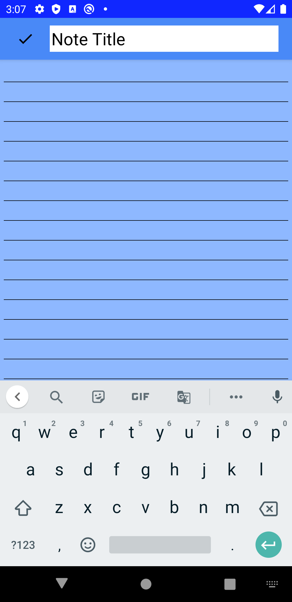

# Notes - Note Taking App

 

This is my first Android application.  Followed CodingWithMitch's [SQLite for Beginners Room Persistence Library](https://codingwithmitch.com/courses/sqlite-room-persistence-android/) Course to build a note-taking application.  

### What I Learned
 - Android Studio
 - Building custom toolbars and customizing behavior
 - RecyclerView and Listeners
 - Avtivity navigation/interaction using intents
 - Room persistence
 - SQLite DB transactions
 - Threading/AsyncTask
 
